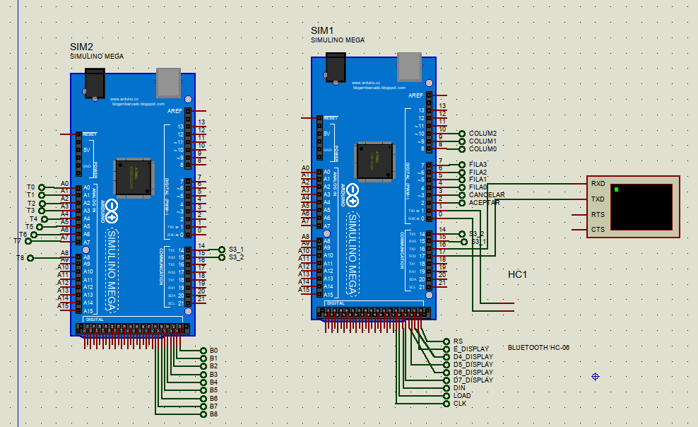

# MANUAL TÉCNICO - PROYECTO 1
  

GRUPO 21

  

## Descripcion
 

## REQUERIMIENTOS

### Simulación

- Proteus 8.10 SP0 (Build 29203) (Para Simulacion)

- Arduino IDE (para compilacion de binarios)

### Componentes

- Dos Arduino Mega
- Una matriz de leds 8x8
- Un controlador MAX719 para la matriz de leds
- Un módulo bluetooth
- Una pantalla LCD 16x4
- Un teclado alfanumérico matricial de 3x4
- Once push button
- Nueve sensores de temperatura LM35

### Librerias

- LedControl
- LiquidCrystal
- EEPROM (librería interna)

## Conexiones Proteus

Los pines análogo A0 a A8 del segundo arduino se utilizan para recibir información de los sensores de temeperatura.
Los pines del 22 al 30 del mismo arduino se utilizan para los botones que representan la presencia o no de un telefono.

En el proteus principal los pines del 22 al 27 se utilizan para la pantalla LCD, y los 28, 29, y 30 para el controlador de la matriz de leds. Los pines del 2 al 10 son utilizados para el teclado matricial y los botones de aceptar y cancelar.
  
  

### Arduino Mega


- Los pines 4,6,7,3 son utilizados para el gamePad (boton D, derecha, izquierda, boton K) 

- El pin A0  y A8 es utilizado para la lectura del potenciometro de velocidad y de vidas

- Los pines 51-53 son utilizados para el control de la matriz con

driver .


  

## Codigo Arduino Principal

### Bloque SETUP

Este bloque se encarga de definir el modo de los pines e inicializacion de objetos.

```cpp
void setup() {
  Serial2.begin(9600);  // Comuniación serial para enviar mensajes de debug
  Serial.begin(9600);   // Comunicación serial para enviar y recibir información del componente de bluetooth
  Serial3.begin(9600);  // Comunicación serial con el arduino de los sensores
  //inicializacion del driver matriz de leds
  matriz.shutdown(0, false);
  matriz.setIntensity(0, 8);
  matriz.clearDisplay(0);
  //inicializacion pantalla
  pantalla.begin(16, 4);
  //inicializacion resto de pines
  for (int i = 2; i <= 7; i++) {
    pinMode(i, INPUT);
  }
  for (int i = 8; i <= 10; i++) {
    pinMode(i, OUTPUT);
  }
  // mensaje inicial
  mensaje_inicial();

  // Verificar si existe la cuenta de admin en memoria
  if (!find_user(ADMIN_NAME)) {
    Serial2.println("Agregar Admin");
    EEPROM.put(EEPROM_USERS_START, '\0');  // Se pone un 0 en la primera posición, para marcar que está vacía
    agregar_usuario(ADMIN_NAME, ADMIN_PASS, "0");
  } else {
    Serial2.println("Hay admin");
  }

  // Verificar la existencia de la información del estado de los casilleros en memoria
  if (EEPROM.read(0) == '\0') {  // Existe casillero
    EEPROM.get(1, casillero);
    fill_casillero();
  }
  render_casillero();
}
```

# Bloque LOOP

El bloque "loop" en Arduino es una estructura de control que se utiliza para repetir una sección de código de forma continua mientras la placa Arduino esté alimentada y funcionando. El programa se mueve por sus diferentes partes por medio de estados.

``` cpp
void loop() {
  // put your main code here, to run repeatedly:
  switch (estado_actual) {
    case MENU:
      {
        //Serial.println("MENU");
        check_casillero();
        pantalla.clear();
        pantalla.setCursor(0, 0);
        pantalla.print("Menu principal");
        pantalla.setCursor(0, 1);
        pantalla.print("Presiona aceptar");
        pantalla.setCursor(0, 2);
        pantalla.print("  Login");
        pantalla.setCursor(0, 3);
        pantalla.print("  Registrar");
        pantalla.setCursor(0, opcion_menu + 2);
        pantalla.print(">");
        while (true) {  //loop que mueve el cursor o detecta el boton aceptar
          char tecla = leerTecla();
          if (tecla == '2') {
            delay(210);
            opcion_menu--;
            if (opcion_menu > 254) opcion_menu = 0;  //254 porque la variable es byte xd
            break;
          }
          if (tecla == '8') {
            delay(210);
            opcion_menu++;
            if (opcion_menu > 1) opcion_menu = 1;
            break;
          }
          if (digitalRead(2) == HIGH) {  //boton aceptar
            delay(210);
            switch (opcion_menu) {
              case 0:
                //estado_actual = ESPERANDO;
                //estado_actual = SESIONADMIN;
                estado_actual = REGISTRO2;
                break;
              case 1:
                //estado_actual = ESPERANDO;
                //siguiente_estado = REGISTRO;
                estado_actual = REGISTRO;
                break;
            }
            opcion_menu = 0;
            break;
          }
        }
        break;
      }
    case LOGS:
      {
        byte cantidad = 0;
        int i = 0;
        EEPROM.get(EEPROM_LOGS_START, cantidad);
        pantalla.clear();
        Serial2.println(cantidad);
        int siguiente_direccion = EEPROM_LOGS_START + 1;
        int indicePantalla = 0;
        bool salir = false;
        while (i < cantidad && !salir) {
          evento cargado;
          EEPROM.get(siguiente_direccion, cargado);
          pantalla.setCursor(2, indicePantalla);
          Serial2.println(cargado.id);
          pantalla.print(cargado.desc);
          pantalla.setCursor(0, indicePantalla);
          pantalla.print(cargado.id);
          //pantalla.print("Imprime");
          siguiente_direccion += sizeof(evento);
          indicePantalla++;
          i++;
          while (indicePantalla == 4) {
            if (digitalRead(2) == HIGH) {
              delay(230);
              indicePantalla = 0;
              pantalla.clear();
            }
            if (digitalRead(3) == HIGH) {
              delay(230);
              salir = true;
              indicePantalla = 0;
              pantalla.clear();
            }
          }
        }
        while (indicePantalla != 0 && !salir) {
          if (digitalRead(2) == HIGH || digitalRead(3) == HIGH) {
            delay(230);
            break;
          }
        }
        estado_actual = SESIONADMIN;
        break;
      }
    case ESPERANDO:
      {

        limpiarBuffer();
        pantalla.clear();
        pantalla.print(" Esperando  una ");
        pantalla.setCursor(0, 1);
        pantalla.print("   conexion...  ");
        bool alguienPorAhi = false;
        char recibidos[3];
        LOOP {
          while (Serial.available()) {
            Serial.readBytes(recibidos, 2);
            alguienPorAhi = true;
          }
          if (alguienPorAhi && !Serial.available()) break;
        }
        estado_actual = siguiente_estado;
        break;
      }
    case LOGIN:
      {

        memset(nombre_temp, 0, 11);
        memset(contra_temp, 0, 11);
        memset(numero_temp, 0, 9);
        struct usuario nuevo_usuario;
        LOOP {
          limpiarBuffer();
          enviarConfirmar("Nombre:");
          memset(nombre_temp, 0, 11);
          pantalla.clear();
          pantalla.print("L O G I N");
          pantalla.setCursor(0, 1);
          pantalla.print(" - NOMBRE:");
          pantalla.setCursor(0, 2);
          // OBTENER CADENA DE APLICACIÓN -- Nombre
          bool seEnvioAlgo = false;
          int indiceNombre = 0;
          long int t0 = millis();
          long int t1 = millis();
          limpiarBuffer();
          LOOP {
            // SI YA SE ENVIO ALGO DESDE LA APLICACION
            while (Serial.available()) {
              seEnvioAlgo = true;
              //   RECIBIRLO
              nombre_temp[indiceNombre++] = Serial.read();
            }
            // CONTROLAR CUANTO HA PASADO DESDE QUE COME...
            if (seEnvioAlgo) {
              t1 = millis();
              if (t1 - t0 >= 500) break;
            } else {
              t0 = millis();
              t1 = millis();
            }
          }
          pantalla.print(nombre_temp);
          pantalla.setCursor(0, 3);
          pantalla.print("Correcto?       ");
          delay(500);
          if (entradaAceptada()) break;
          pantalla.setCursor(0, 2);
          pantalla.print(LINEA_VACIA);
          pantalla.setCursor(0, 3);
          pantalla.print(LINEA_VACIA);
        }
        LOOP {
          limpiarBuffer();
          enviarConfirmar("Contras:");
          memset(contra_temp, 0, 11);
          pantalla.clear();
          pantalla.print("L O G I N");
          pantalla.setCursor(0, 1);
          pantalla.print(" - Contras:");
          pantalla.setCursor(0, 2);
          // OBTENER CADENA DE APLICACIÓN -- Nombre
          bool seEnvioAlgo = false;
          int indiceContra = 0;
          long int t0 = millis();
          long int t1 = millis();
          limpiarBuffer();
          LOOP {
            // SI YA SE ENVIO ALGO DESDE LA APLICACION
            while (Serial.available()) {
              seEnvioAlgo = true;
              //   RECIBIRLO
              contra_temp[indiceContra++] = Serial.read();
            }
            // CONTROLAR CUANTO HA PASADO DESDE QUE COME...
            if (seEnvioAlgo) {
              t1 = millis();
              if (t1 - t0 >= 500) break;
            } else {
              t0 = millis();
              t1 = millis();
            }
          }
          imprimirAsteriscos(contra_temp);
          pantalla.setCursor(0, 3);
          pantalla.print("Correcto?       ");
          delay(500);
          if (entradaAceptada()) break;
          pantalla.setCursor(0, 2);
          pantalla.print(LINEA_VACIA);
          pantalla.setCursor(0, 3);
          pantalla.print(LINEA_VACIA);
        }
        enviarConfirmar("NADA");
        bool encontrado = validar_credenciales(nombre_temp, contra_temp);
        pantalla.clear();


        if (strcmp(nombre_temp, ADMIN_NAME) == 0 && strcmp(contra_temp, ADMIN_PASS) == 0) {
          pantalla.print("ADMIN");
          delay(50);
          estado_actual = SESIONADMIN;
          agregarlogs("loginAE");
        } else if (encontrado == true) {
          estado_actual = SESION;
          agregarlogs("loginUE");
        } else {
          //pantalla.print(nombre_temp);
          //pantalla.print(contra_temp);
          delay(50);
          estado_actual = MENU;
          agregarlogs("loginFA");
          update_stats(INT_FALLIDOS,1);
        }

        delay(2000);
        break;
        break;
      }
    case SESIONADMIN:
      {
        check_casillero();
        pantalla.clear();
        pantalla.setCursor(0, 0);
        pantalla.print("Presiona aceptar");
        pantalla.setCursor(0, 1);
        pantalla.print("  Logs");
        pantalla.setCursor(0, 2);
        pantalla.print("  Estado Sys");
        pantalla.setCursor(0, 3);
        pantalla.print("  Cerrar sesion");
        pantalla.setCursor(0, opcion_menu + 1);
        pantalla.print(">");
        while (true) {  //loop que mueve el cursor o detecta el boton aceptar
          char tecla = leerTecla();
          if (tecla == '2') {
            delay(210);
            opcion_menu--;
            if (opcion_menu > 254) opcion_menu = 0;  //254 porque la variable es byte xd
            break;
          }
          if (tecla == '8') {
            delay(210);
            opcion_menu++;
            if (opcion_menu > 2) opcion_menu = 2;
            break;
          }
          if (digitalRead(2) == HIGH) {  //boton aceptar
            delay(210);
            switch (opcion_menu) {
              case 0:
                //estado_actual = LOGS;
                show_logs();
                break;
              case 1:
                //estado_actual = ESPERANDO;
                //siguiente_estado = REGISTRO;
                show_stats();
                break;
              case 2:
                //estado_actual = ESPERANDO;
                //siguiente_estado = REGISTRO;
                estado_actual = MENU;
                agregarlogs("CerradoA");
                break;
            }
            opcion_menu = 0;
            break;
          }
        }
        break;
      }
    case SESION:
      {
        check_casillero();
        pantalla.clear();
        pantalla.setCursor(0, 0);
        pantalla.print(" Ingreso Cel");
        pantalla.setCursor(0, 1);
        pantalla.print(" Retiro Cel");
        pantalla.setCursor(0, 2);
        pantalla.print(" Cerrar sesion");
        pantalla.setCursor(0, 3);
        pantalla.print(" Eliminar Cuenta");
        pantalla.setCursor(0, opcion_menu);
        pantalla.print(">");
        while (true) {  //loop que mueve el cursor o detecta el boton aceptar
          char tecla = leerTecla();
          if (tecla == '2') {
            delay(210);
            opcion_menu--;
            if (opcion_menu > 254) opcion_menu = 0;  //254 porque la variable es byte xd
            break;
          }
          if (tecla == '8') {
            delay(210);
            opcion_menu++;
            if (opcion_menu > 3) opcion_menu = 3;
            break;
          }
          if (digitalRead(2) == HIGH) {  //boton aceptar
            delay(210);
            switch (opcion_menu) {
              case 0:
                //estado_actual = ESPERANDO;
                //siguiente_estado = APLICACION;
                ingresar_telefono(nombre_temp);
                break;
              case 1:
                //estado_actual = ESPERANDO;
                //siguiente_estado = REGISTRO;
                retirar_telefono(nombre_temp);
                break;
              case 2:
                //estado_actual = ESPERANDO;
                //siguiente_estado = REGISTRO;
                estado_actual = MENU;
                agregarlogs("CerradoUS");
                break;
              case 3:
                if (eliminar_cuenta(nombre_temp)) {
                  estado_actual = MENU;
                } else {
                  // menu remover
                }
                break;
            }
            opcion_menu = 0;
            break;
          }
        }
        break;
      }

    case RPANEL:
    {

      char buffer[16] = { 0 };
      char buffer2[16] = { 0 };
      char buffer3[16] = { 0 };
        
      goto nombre_panel;
      err_nombre_panel:{
        pantalla.clear();
        pantalla.setCursor(0, 0);
        pantalla.print("Error");
        pantalla.setCursor(0, 1);
        pantalla.print("Nombre no valido");
        for(uint8_t i = 0; buffer[i]!='\0';i++){buffer[i]='\0';}
        delay(300);
      };

      nombre_panel:
      pantalla.clear();
      pantalla.setCursor(0, 0);
      pantalla.print("REGISTRO");
      pantalla.setCursor(0, 1);
      pantalla.print(" - NOMBRE:");

      if (keyboard_input(buffer, 2)) {
        delay(100);
        if(!validar_nombre(buffer)){
            goto err_nombre_panel;
        }
        strcpy(nombre_temp, buffer); 
      }

      goto contra_panel; 
      err_contra_panel:{
        pantalla.clear();
        pantalla.setCursor(0, 0);
        pantalla.print("Error");
        pantalla.setCursor(0, 1);
        pantalla.print("Contra no valida");
        for(uint8_t i = 0; buffer2[i]!='\0';i++){buffer[i]='\0';}
        delay(300);
      };

      contra_panel:
      pantalla.clear();
      pantalla.setCursor(0, 0);
      pantalla.print("REGISTRO");
      pantalla.setCursor(0, 1);
      pantalla.print(" - CONTRA:");

      if (keyboard_input(buffer2, 2)) {
        delay(100);
        if(!validar_contra(buffer2)){
            goto err_contra_panel;
        }
        strcpy(contra_temp,buffer2); 
      }

      goto numero_panel;
      err_number_panel:{
        pantalla.clear();
        pantalla.setCursor(0, 0);
        pantalla.print("Error");
        pantalla.setCursor(0, 1);
        pantalla.print("Numero no valido");
        for(uint8_t i = 0; buffer3[i]!='\0';i++){buffer[i]='\0';}
        delay(300);
      };

      numero_panel:
      pantalla.clear();
      pantalla.setCursor(0, 0);
      pantalla.print("REGISTRO");
      pantalla.setCursor(0, 1);
      pantalla.print(" - NUMERO:");
      if (keyboard_input(buffer3, 2)) {
        delay(100);
        if(!validar_numero(buffer3)){
            goto err_number_panel;
        }
        strcpy(numero_temp,buffer3);
        
      }

      bool usuario_creado = agregar_usuario(nombre_temp, contra_temp, numero_temp);
      if (usuario_creado) {
        estado_actual = MENU;
      }
    

      break;

    }
    case PANEL:
      {
        pantalla.clear();
        pantalla.setCursor(0, 0);
        pantalla.print("LOGIN");
        pantalla.setCursor(0, 1);
        pantalla.print(" - NOMBRE:");
        char buffer[16] = { 0 };
        char buffer2[16] = { 0 };

        if (keyboard_input(buffer, 2)) {
          delay(100);
          strcpy(nombre_temp, buffer);
          pantalla.clear();
          pantalla.setCursor(0, 0);
          pantalla.print("Login");
          pantalla.setCursor(0, 1);
          pantalla.print(" - CONTRA:");
          
        }

        

        if (keyboard_input(buffer2, 2)) {
          delay(100);
          strcpy(contra_temp,buffer2);
          
        }

        if(validar_credenciales(buffer, buffer2)){
          pantalla.clear();
          delay(500);
          if(strcmp(nombre_temp, ADMIN_NAME) == 0 && strcmp(contra_temp, ADMIN_PASS) == 0){
            estado_actual = SESIONADMIN;
            agregarlogs("loginAE");
          }else{
            estado_actual = SESION;
            agregarlogs("loginUE");
          }
          
        }else{
          pantalla.clear();
          estado_actual = MENU;
          agregarlogs("loginFA");
        }


        break;
      }


    case REGISTRO2:
      {
        pantalla.clear();
        pantalla.setCursor(0, 0);
        pantalla.print("Presiona aceptar");
        pantalla.setCursor(0, 1);
        pantalla.print("  Aplicacion");
        pantalla.setCursor(0, 2);
        pantalla.print("  Panel");
        pantalla.setCursor(0, 3);
        pantalla.print("  Salir");
        pantalla.setCursor(0, opcion_menu + 1);
        pantalla.print(">");
        while (true) {  //loop que mueve el cursor o detecta el boton aceptar
          char tecla = leerTecla();
          if (tecla == '2') {
            delay(210);
            opcion_menu--;
            if (opcion_menu > 254) opcion_menu = 0;  //254 porque la variable es byte xd
            break;
          }
          if (tecla == '8') {
            delay(210);
            opcion_menu++;
            if (opcion_menu > 2) opcion_menu = 2;
            break;
          }
          if (digitalRead(2) == HIGH) {  //boton aceptar
            delay(210);
            switch (opcion_menu) {
              case 0:
                estado_actual = ESPERANDO;
                siguiente_estado = LOGIN;

                break;
              case 1:
                estado_actual = PANEL;
                break;
              case 2:
                estado_actual = MENU;
                break;
            }
            opcion_menu = 0;
            break;
          }
        }
        break;
      }
    case REGISTRO:
      {
        pantalla.clear();
        pantalla.setCursor(0, 0);
        pantalla.print("Presiona aceptar");
        pantalla.setCursor(0, 1);
        pantalla.print("  Aplicacion");
        pantalla.setCursor(0, 2);
        pantalla.print("  Panel");
        pantalla.setCursor(0, 3);
        pantalla.print("  Salir");
        pantalla.setCursor(0, opcion_menu + 1);
        pantalla.print(">");
        while (true) {  //loop que mueve el cursor o detecta el boton aceptar
          char tecla = leerTecla();
          if (tecla == '2') {
            delay(210);
            opcion_menu--;
            if (opcion_menu > 254) opcion_menu = 0;  //254 porque la variable es byte xd
            break;
          }
          if (tecla == '8') {
            delay(210);
            opcion_menu++;
            if (opcion_menu > 2) opcion_menu = 2;
            break;
          }
          if (digitalRead(2) == HIGH) {  //boton aceptar
            delay(210);
            switch (opcion_menu) {
              case 0:
                estado_actual = ESPERANDO;
                siguiente_estado = APLICACION;

                break;
              case 1:
                //estado_actual = ESPERANDO;
                //siguiente_estado = REGISTRO;
                estado_actual = RPANEL;
                break;
              case 2:
                //estado_actual = ESPERANDO;
                //siguiente_estado = REGISTRO;
                estado_actual = MENU;
                break;
            }
            opcion_menu = 0;
            break;
          }
        }
        break;
      }
    case APLICACION:
      {

        memset(nombre_temp, 0, 13);
        memset(contra_temp, 0, 13);
        memset(numero_temp, 0, 9);
        struct usuario nuevo_usuario;
        LOOP {
          goto nombre_app;
          err_nombre_app:{
            pantalla.clear();
            pantalla.setCursor(0, 0);
            pantalla.print("Error");
            pantalla.setCursor(0, 1);
            pantalla.print("Nombre no valido");
            for(uint8_t i = 0; nombre_temp[i]!='\0';i++){nombre_temp[i]='\0';}
            delay(300);
          };
          nombre_app:
          limpiarBuffer();
          enviarConfirmar("Nombre:");
          memset(nombre_temp, 0, 13);
          pantalla.clear();
          pantalla.print("R E G I S T R O");
          pantalla.setCursor(0, 1);
          pantalla.print(" - NOMBRE:");
          pantalla.setCursor(0, 2);
          // OBTENER CADENA DE APLICACIÓN -- Nombre
          bool seEnvioAlgo = false;
          int indiceNombre = 0;
          long int t0 = millis();
          long int t1 = millis();
          limpiarBuffer();
          LOOP {
            // SI YA SE ENVIO ALGO DESDE LA APLICACION
            while (Serial.available()) {
              seEnvioAlgo = true;
              //   RECIBIRLO
              nombre_temp[indiceNombre++] = Serial.read();
            }
            // CONTROLAR CUANTO HA PASADO DESDE QUE COME...
            if (seEnvioAlgo) {
              t1 = millis();
              if (t1 - t0 >= 500) break;
            } else {
              t0 = millis();
              t1 = millis();
            }
          }
          pantalla.print(nombre_temp);
          pantalla.setCursor(0, 3);
          pantalla.print("Correcto?       ");
          delay(500);
          if (entradaAceptada()){ 
              if(!validar_nombre(nombre_temp)){
                  goto err_nombre_app;
              }
              break;
          }
          pantalla.setCursor(0, 2);
          pantalla.print(LINEA_VACIA);
          pantalla.setCursor(0, 3);
          pantalla.print(LINEA_VACIA);
        }
        LOOP {
          goto tel_app;
          err_tel_app:{
            pantalla.clear();
            pantalla.setCursor(0, 0);
            pantalla.print("Error");
            pantalla.setCursor(0, 1);
            pantalla.print("Numero no valido");
            for(uint8_t i = 0; numero_temp[i]!='\0';i++){numero_temp[i]='\0';}
            delay(300);
          };
          tel_app:
          limpiarBuffer();
          enviarConfirmar("Celular:");
          memset(numero_temp, 0, 9);
          pantalla.clear();
          pantalla.print("R E G I S T R O");
          pantalla.setCursor(0, 1);
          pantalla.print(" - Celular:");
          pantalla.setCursor(0, 2);
          // OBTENER CADENA DE APLICACIÓN -- Nombre
          bool seEnvioAlgo = false;
          int indiceNumero = 0;
          long int t0 = millis();
          long int t1 = millis();
          limpiarBuffer();
          LOOP {
            // SI YA SE ENVIO ALGO DESDE LA APLICACION
            while (Serial.available()) {
              seEnvioAlgo = true;
              //   RECIBIRLO
              numero_temp[indiceNumero++] = Serial.read();
            }
            // CONTROLAR CUANTO HA PASADO DESDE QUE COME...
            if (seEnvioAlgo) {
              t1 = millis();
              if (t1 - t0 >= 500) break;
            } else {
              t0 = millis();
              t1 = millis();
            }
          }
          pantalla.print(numero_temp);
          pantalla.setCursor(0, 3);
          pantalla.print("Correcto?       ");
          delay(500);
          if (entradaAceptada()){
            if(!validar_numero(numero_temp)){
                goto err_tel_app;
            }
            break;
          }
          pantalla.setCursor(0, 2);
          pantalla.print(LINEA_VACIA);
          pantalla.setCursor(0, 3);
          pantalla.print(LINEA_VACIA);
        }
        LOOP {
          goto pass_app;
          err_pass_app:{
            pantalla.clear();
            pantalla.setCursor(0, 0);
            pantalla.print("Error");
            pantalla.setCursor(0, 1);
            pantalla.print("Numero no valido");
            for(uint8_t i = 0; contra_temp[i]!='\0';i++){contra_temp[i]='\0';}
            delay(300);
          };
          pass_app:
          limpiarBuffer();
          enviarConfirmar("Contras:");
          memset(contra_temp, 0, 13);
          pantalla.clear();
          pantalla.print("R E G I S T R O");
          pantalla.setCursor(0, 1);
          pantalla.print(" - Contras:");
          pantalla.setCursor(0, 2);
          // OBTENER CADENA DE APLICACIÓN -- Nombre
          bool seEnvioAlgo = false;
          int indiceContra = 0;
          long int t0 = millis();
          long int t1 = millis();
          limpiarBuffer();
          LOOP {
            // SI YA SE ENVIO ALGO DESDE LA APLICACION
            while (Serial.available()) {
              seEnvioAlgo = true;
              //   RECIBIRLO
              contra_temp[indiceContra++] = Serial.read();
            }
            // CONTROLAR CUANTO HA PASADO DESDE QUE COME...
            if (seEnvioAlgo) {
              t1 = millis();
              if (t1 - t0 >= 500) break;
            } else {
              t0 = millis();
              t1 = millis();
            }
          }
          imprimirAsteriscos(contra_temp);
          pantalla.setCursor(0, 3);
          pantalla.print("Correcto?       ");
          delay(500);
          if (entradaAceptada()){ 
              if(!validar_contra(contra_temp)){
                  goto err_pass_app;
              }
              break;
          }
          pantalla.setCursor(0, 2);
          pantalla.print(LINEA_VACIA);
          pantalla.setCursor(0, 3);
          pantalla.print(LINEA_VACIA);
        }
        // true -> creado , false -> no creado
        bool usuario_creado = agregar_usuario(nombre_temp, contra_temp, numero_temp);
        if (usuario_creado) {
          estado_actual = MENU;
        }
      }
  }
}
```

  
  

## Funciones y Metodos utilizados por los bloques anteriores


### Variables globales y definiciones

 ```cpp 

 // Representación del teclado matricial
 char teclas[4][3] = { { '1', '2', '3' },
                      { '4', '5', '6' },
                      { '7', '8', '9' },
                      { '*', '0', '#' } };

#define LOOP while(true)
#define LINEA_VACIA "                "

// Diplay LCD, donde se le mostrará texto al usuario
LiquidCrystal pantalla = LiquidCrystal(22, 23, 24, 25, 26, 27);
// Matriz de leds dónde se mostrará el estado del casillero de telefónos
LedControl matriz = LedControl(28, 30, 29, 1);

// Estados del programa. Se navega por los menues del programa modificando los su estado_actual
enum estados {
  MENU,
  REGISTRO,
  REGISTRO2,
  ESPERANDO,
  LOGIN,
  LOGS,
  APLICACION,
  SESION,
  SESIONADMIN,
  PANEL,
  RPANEL
} siguiente_estado,
  estado_actual = MENU;
byte opcion_menu = 0;

// variables donde se almacenan el nombre de usuario, contraseña y número de teléfono de una sesión
char nombre_temp[16];
char contra_temp[16];
char numero_temp[16];

// Estructura de los logs o eventos
typedef struct{
    uint8_t id; // de 0 a 99
    char    desc[15];  // descripición del log
}evento; // o log

// Estadísticas sobre el estado del programa
typedef struct{
    uint8_t celulares; // celulares en el sistema
    uint8_t fallidos; // intentos de inicio de sesión históricos
    uint8_t incidentes; //Incidentes en el casillero de telefono
    uint8_t usuarios; // cantidad de usuarios activos
}admin_stats;

// Estado de una casilla del casiller
typedef struct{
    bool available; // Disponibilidad de la casilla
    char user[13]; // Usuario del telefono en la casilla
}phone;

// Casillero con 9 espacios
typedef phone phone_deposit[9];

// Datos del usuario
struct usuario {
    char nombre[13];
    char contra[13];
    char numero[9] ;
};

// Tipo de operación sobre el casillero
typedef enum{
    REMOVE, // remover telefono
    DEPOSIT // depositar telefono
}operation;

// Fuente del input del usuario
typedef enum{
    APP_INPUT, // Por medio la aplicación de android
    KB_INPUT   // Por medio del teclado matricial
}input_type;

// Tipo de estadística de estado del sistema a modificar
typedef enum{
    CEL_INGRESADOS, // Telefonos en el sistema
    INT_FALLIDOS,   // Intentos de inicio de sesión fallidos
    INCIDENTES,     // Incidentes en el casillero de telefono
    N_USUARIOS      // Número de usuarios activos
}adm_stat;

// Variable global para definir la fuente del input
input_type tipoEntrada;

// Posiciones en memoria de las estadísticas del sistema, lista de usuario, y logs
#define ADMIN_STATS_START  sizeof(phone_deposit) + 1
#define EEPROM_USERS_START sizeof(phone_deposit) + 1 + sizeof(admin_stats) + 1
#define EEPROM_LOGS_START EEPROM.length() - 100*sizeof(evento)


// Llaves de encriptación
#define LLAVE1 '5'
#define LLAVE2 '3'

// Credenciales del administrador
#define ADMIN_NAME "ADMIN*05645"
#define ADMIN_PASS "GRUPO21"

// Para definir las celdas por defecto del casillero en la matriz de leds
#define SEP    {0,0,1,0,0,1,0,0}
#define FLINE  {1,1,1,1,1,1,1,1}

// Retraso para el input del teclado matricial
#define KEYBOARD_DELAY 100

// Tiempo máximo que una sesión puede estar idle (5 minutos)
#define MAX_SESSION_TIME 1000*300

// Telefono y casillere por defecto
const phone default_phone = { .available = true, .user = {'\0'}} ;
phone_deposit casillero = { default_phone,default_phone,default_phone,default_phone,default_phone,default_phone,default_phone,default_phone,default_phone };

// Variable que almacene el tiempo de la ultima vez que el usuario realizó una acción
long int current_session_time;

// Estadísticas del admin
admin_stats adm_stats;

// Matriz que representa los leds de la matriz de led
uint8_t led_casillero[8][8] = {
    SEP,
    SEP,
    FLINE,
    SEP,
    SEP,
    FLINE,
    SEP,
    SEP
};

// Secuencia de teclas para el input del tecado matricial
char teclado_matricial[9][5] = {
    {'1','*','$','#','!'},
    {'2','A','B','C','0'}, // La tecla 0 se utiliza para otra función, por eso aparece el 0 aquí.
    {'3','D','E','F','\0'},
    {'4','G','H','I','\0'},
    {'5','J','K','L','\0'},
    {'6','M','N','O','\0'},
    {'7','P','Q','R','S'},
    {'8','T','U','V','\0'},
    {'9','W','X','Y','Z'}
};

 ```

### Entrada de datos

#### Tipo de Input

Cambia el valor de una variable para determinar si se realizará la entrada por medio de la aplicación o por medio de el teclado matricial.

```cpp
void tipo_de_input(){
    update_session_time();
    pantalla.clear();
    pantalla.setCursor(0, 0);
    pantalla.println("TIPO DE INPUT:");
    pantalla.setCursor(0, 1);
    pantalla.println("# APLICACION");
    pantalla.setCursor(0, 2);
    pantalla.println("* TECLADO");
    while(true){
        if(estado_actual == SESION && !check_session_time()){loop();}
        char seleccion = leerTecla(); 
        delay(KEYBOARD_DELAY);
        if (seleccion == '*'){
            tipoEntrada = KB_INPUT; 
            if(estado_actual == SESION ){update_session_time();}
            break;
        }else if(seleccion == '#'){
            tipoEntrada = APP_INPUT;
            if(estado_actual == SESION ){update_session_time();}
            break;
        }

    }
    pantalla.clear();
}
```

#### Entrada por medio del teclado matricial

 Utiliza el teclado matricial para llenar un arreglo de caracteres. Retorna verdadero si el usuario da a aceptar, falso si da a cancelar.
 El parametro line determina la línea en la que se mostrará el input
```cpp
bool keyboard_input(char* buffer,uint8_t line){
    pantalla.setCursor(0, line);
    uint8_t key_pos = 0;
    uint8_t buffer_index = 0;
    for(;;){
        pantalla.setCursor(0, line);
        char key = leerTecla();
        delay(KEYBOARD_DELAY);
        uint8_t key_index;
        bool next =  false; 
        bool prev = false;
        switch(key){
            case '1':
                key_index = 0;
                key_pos = 0;
                break;
            case '2':
                key_index = 1;
                key_pos = 0;
                break;
            case '3':
                key_index = 2;
                key_pos = 0;
                break;
            case '4':
                key_index = 3;
                key_pos = 0;
                break;
            case '5':
                key_index = 4;
                key_pos = 0;
                break;
            case '6':
                key_index = 5;
                key_pos = 0;
                break;
            case '7':
                key_index = 6;
                key_pos = 0;
                break;
            case '8':
                key_index = 7;
                key_pos = 0;
                break;
            case '9':
                key_index = 8;
                key_pos = 0;
                break;
            case '*':
                prev = true;
                break;
            case '#':
                next = true;
                break;
            case '0':
                if(buffer[buffer_index]!='\0'){
                    buffer_index++;
                }
                continue;
                break;
            default:

                if (digitalRead(2) == HIGH) { // botón aceptar 
                    Serial2.println("aceptar");
                    delay(KEYBOARD_DELAY);
                    update_session_time();
                    return true;
                }

                if(digitalRead(3) == HIGH){ // botón cancelar
                    Serial2.println("cancelar");
                    for(uint8_t i = 0; buffer[i]!='\0';i++){buffer[i]='\0';}
                    delay(KEYBOARD_DELAY);
                    update_session_time();
                    return false;
                }
                if(estado_actual == SESION && !check_session_time()){loop();}

                continue;
                break;
        }
        update_session_time();

        if(next){
            key_pos = ( key_pos == 4 || teclado_matricial[key_index][key_pos + 1 ] == '\0' ) ? 0 : key_pos + 1;
        }else if(prev){
            key_pos = ( key_pos == 0 ) ? 4 : key_pos - 1;
            if(key_pos == 4 && teclado_matricial[key_index][key_pos] == '\0'){
                key_pos--;
            }
        }
        buffer[buffer_index] = teclado_matricial[key_index][key_pos];
        pantalla.println(buffer);
        Serial2.println(buffer);
    }
    return false;
}

```

#### Entrada por medio de la aplicación (bluetooth)

Envía una un mensaje al usario por medio del puerto serial, a través de bluetooth y recibe los datos que envía el usario por el mismo canal.

```cpp
bool bluetooth_input(char* buffer,char* message){ 

    limpiarBuffer();
    pantalla.clear();
    pantalla.print(" Esperando  una ");
    pantalla.setCursor(0, 1);
    pantalla.print("   conexion...  ");
    bool alguienPorAhi = false;
    char recibidos[3];
    while(true) {
        while(Serial.available()) {

            if(estado_actual == SESION && !check_session_time()){loop();}
            Serial.readBytes(recibidos, 2);
            alguienPorAhi = true;
            break;
        }
        if(alguienPorAhi){break;}
    }
    update_session_time();
    while(true){

        if(estado_actual == SESION && !check_session_time()){loop();}
        bool seEnvioAlgo = false;
        int indiceBuffer = 0;
        long int t0 = millis();
        long int t1 = millis();
        limpiarBuffer();
        enviarConfirmar(message);
        pantalla.clear();
        pantalla.setCursor(0,0);
        pantalla.println(message);
        while(true){
            while (Serial.available()) {
                seEnvioAlgo = true;
                buffer[indiceBuffer++] = Serial.read();
            }
            if (seEnvioAlgo) {
                t1 = millis();
                if (t1 - t0 >= 500) break;
            } else {
                t0 = millis();
                t1 = millis();
            }
        }
        update_session_time();
        pantalla.setCursor(0,1);
        pantalla.println(buffer);
        pantalla.setCursor(0,2);
        pantalla.print("Aceptar?       ");
        delay(500);
        if (entradaAceptada()){ update_session_time(); return true;}
        for(uint8_t i = 0; buffer[i]!='\0';i++){buffer[i]='\0';}
    }
}
```
### Registro de usuarios

### Guardado de usuario en memoria

Guarda en memoria un struct de usuario, con su nombre, contraseña y número de telefono cifrados.

```cpp
bool agregar_usuario(char* username, char* password, char* phone_number){
    if(find_user(username)){
        Serial2.println("El usuario ya existe");
        return false;
    }
    struct usuario new_user;
    char* enc_usr = xor_encode(username);
    char* enc_pass = xor_encode(password);
    char* enc_number = xor_encode(enc_number);
    uint16_t pos;
    struct usuario load;
    for(pos = EEPROM_USERS_START ; pos < EEPROM_LOGS_START ; pos+=sizeof(struct usuario) ){
        EEPROM.get(pos,load);
        if(EEPROM.read(pos) == '\0'){
            break;
        }
    }
    strncpy(new_user.nombre,enc_usr,13);
    strncpy(new_user.contra,enc_pass,13);
    strncpy(new_user.numero,enc_number,9);
    EEPROM.put(pos,new_user);

    struct usuario check;
    EEPROM.get(pos+sizeof(struct usuario),check);
    if(!find_user(xor_decode(check.nombre)) || pos + sizeof(struct usuario) < EEPROM_LOGS_START ){
        // Colocar un \0 para marcar que hay un espacio vacio contiguo
        // sólo si no hay otro registro de usuario o si está en la última posición
        EEPROM.put(pos+sizeof(struct usuario),'\0');
    }
    Serial2.println("---Nuevo usuario---");
    Serial2.print(enc_usr);
    Serial2.print(" ");
    Serial2.print(enc_pass);
    Serial2.print(" ");
    Serial2.print(enc_number);
    Serial2.println("");
    Serial2.println("-------------------");
    free(enc_usr);
    free(enc_pass);
    update_stats(N_USUARIOS,1);
    return true;
}

```

#### Cifrado

El doble cifrado y descifrado XOR, utilizando las llaves definidas anteriomente.

```cpp
/*
* Cifrado XOR, usando las 2 llaves 
*/
char* xor_encode(char* input){
    char keys[2] = {LLAVE1,LLAVE2}; // Falta definir cual es la llave de verdad, ver enunciado xd
    uint8_t len = strlen(input);
    char* ret = (char*)malloc(sizeof(char)*13);
    strncpy(ret,input,12);
    for(uint8_t key = 0; key < 2; key++ ){
        for(uint8_t i = 0; i<len; i++){
            ret[i] = ret[i] ^ keys[key];
        }
    }
    return ret;
}


/*
* Descifrado XOR, usando las 2 llaves
*/
char* xor_decode(char* input){
    char keys[2] = {LLAVE2,LLAVE1};
    uint8_t len = strlen(input);
    char* ret = (char*)malloc(sizeof(char)*13);
    strncpy(ret,input,12);
    for(uint8_t key = 0; key < 2; key++ ){
        for(uint8_t i = 0; i<len; i++){
            ret[i] = ret[i] ^ keys[key];
        }
    }
    return ret;
}
```

#### Comprobación de validez de cadenas

Valida que el número de telefono tenga una longitud de 8 caracteres y que todos los caracteres sean dígitos.

```cpp  
bool validar_numero(char* numero){
    uint8_t len = strlen(numero);
    if(len != 8){return false;}
    char c;
    for(uint8_t ci = 0;ci<len;ci++){
        c = numero[ci];
        if(!isdigit(c)){return false;}
    }
    return true;
}
```

Valida que el nombre de usuario tenga una longitud de entre 8 y 12 caracteres, y valida que todos los caracteres sean digitos o letras.

``` cpp
bool validar_nombre(char* nombre){
    uint8_t len = strlen(nombre);
    if(len > 12 || len < 8){return false;}
    char c;
    for(uint8_t ci = 0;ci<len;ci++){
        c = nombre[ci];
        if(!isdigit(c) && !isalpha(c)){return false;}
    }
    return true;
}
```
Valida que la longitud de la contraseña esté entre 12 y 8 caracteres, y que contenga por lo menos un caracter de letra [A-Z], uno de dígito [0-9] y un caracter especial \[\*\#$\!\]

``` cpp
bool validar_contra(char* pass){
    uint8_t len = strlen(pass);
    if(len > 12 || len < 8){return false;}
    bool flag_digit = false;
    bool flag_alpha = false;
    bool flag_especial= false;
    char c;
    for(uint8_t ci = 0;ci<len;ci++){
        c = pass[ci];
        if(isdigit(c)){
            flag_digit = true; 
        }
        if(isalpha(c)){
            flag_alpha = true;
        }
        if(c == '*' || c == '#' || c == '$' || c == '!'){
            flag_especial = true;
        }
    }
    return flag_digit && flag_alpha && flag_especial;
    
}
```
### Eliminación de cuente

Elimina una porción de memoria en la que se encuentre un usario.

```cpp
bool eliminar_cuenta(char* user){
    if(!find_user(user)){
        Serial2.println("El usuario no existe");
        return false;
    }
    for(int space = 0; space<9; space++){
        if( !casillero[space].available && strncmp(user,casillero[space].user,12) == 0){
            // No se puede eliminar la cuenta si tiene dispositivos en el casillero
            // Mandar al menú de retiro
            pantalla.clear();
            pantalla.setCursor(0,0);
            pantalla.println("CEL en Sistema");
            pantalla.println("Menu de retiro...");
            delay(400);
            retirar_telefono(user);
            return false;
        }
    }
    // ¿ No pide contraseña para eliminar la cuenta ? 
    // eliminar usuario de la EEPROM
    uint16_t pos;
    struct usuario load;
    char* enc_usr = xor_encode(user);
    for(pos = EEPROM_USERS_START; pos < EEPROM_LOGS_START ; pos+=sizeof(struct usuario) ){
        EEPROM.get(pos,load);
        if(strcmp(load.nombre,enc_usr) == 0){
            for(uint8_t pos_user=0; pos_user < sizeof(struct usuario)-1; pos_user++){
                EEPROM.put(pos+pos_user,'\0');
            }
            Serial2.println("Usuario Borrado");
            free(enc_usr);
            
            log_EEPROM("RMV USR");
            update_stats(N_USUARIOS,-1);
            return true;
        }
    }
    //no se borró
    free(enc_usr);
    return false;
}

```

### Casillero de celulares

#### Ingresar telefono

Le asigna un compartimiento al telefono, verifica si hay alguna anomalía en este, y espera que el usuario coloque el telefono.

```cpp
void ingresar_telefono(char* user){
    //realizar comprobacion de las condciones del casillero 
    for(int space = 0; space<9; space++){
        if( casillero[space].available ){

            char pos  = space + '0';
            pantalla.clear();
            pantalla.setCursor(0,0);
            pantalla.println("Intoduzca CEL en");
            pantalla.setCursor(0,1);
            pantalla.print(" POS #");
            pantalla.print(pos);
            while(true){
                if(!check_deposit('B',space) ){ // el botón *no está* presionado
                    break;
                }
            }
            pantalla.clear();
            pantalla.setCursor(0,0);
            pantalla.println("MUCHO CALOR en");
            pantalla.setCursor(0,1);
            pantalla.print(" POS #");
            pantalla.print(pos);
            while(true){
                if(!check_deposit('T',space) ){ // no hay una gran temperatura 
                    break;
                }
            }
            if(!pedir_password()){
                log_EEPROM("INGR CEL FAIL");
                return;
            } 
            casillero[space].available = false;
            strncpy(casillero[space].user,user,12);
            update_deposit(space,DEPOSIT);
            update_stats(CEL_INGRESADOS,1);
            log_EEPROM("INGR CEL OK");
            break;
        } 
    }
}
```

#### Retirar telefono

Le muestra al usuario una lista con los compartimientos en los que tiene un telefono para que elija cuál sacar. Luego espera a que lo retire.

```cpp
void retirar_telefono(char* user){

    uint8_t user_phone[9] = {255,255,255,255,255,255,255,255,255};
    uint8_t phone_count = 0;

    for(uint8_t space = 0; space<9; space++){
        if( !casillero[space].available && strncmp(user,casillero[space].user,12) == 0){
            user_phone[space] = space;
            phone_count++;
        }
    }
    if (phone_count == 0){
        return;
    }

    uint8_t selected = 255;

    pantalla.clear();
    uint8_t line = 0;
    for(uint8_t p = 0; p<9; p++){
        if(p == 3  || p == 6){line++; pantalla.setCursor(0,line);};
        if(user_phone[p] == 255){continue;}
        char c = user_phone[p] + '0';
        pantalla.println(c);
    }
    line++;
    pantalla.setCursor(0,line);
    pantalla.print("Opcion: ");
    char buf = '\0';
    while(selected == 255){
        pantalla.setCursor(7,line);
        pantalla.print(" ");
        pantalla.setCursor(7,line);
        buf = leerTecla();
        delay(KEYBOARD_DELAY);
        if (buf == ' ' || buf == '*' || buf == '#'){continue;}
        pantalla.print(buf);
        uint8_t index = buf - '0';
        delay(KEYBOARD_DELAY*2);
        if(user_phone[index]==255){
            continue; 
        }
        selected = index;

    }
    if(!pedir_password()){
        log_EEPROM("RM CEL FAIL");
        return;
    } 
    pantalla.clear();
    pantalla.setCursor(0,0);
    pantalla.println("Retire CEL en");
    pantalla.setCursor(0,1);
    pantalla.print(" POS #");
    char pos  = selected + '0';
    pantalla.print(pos);
    while(true){
        if(check_deposit('B',selected) ){ // el botón *no está* presionado
            break;
        }
    }
    char sacado = selected + '0';
    casillero[selected] = default_phone;
    update_deposit(selected,REMOVE);
    pantalla.clear();
    pantalla.setCursor(0,0);
    pantalla.print("Sacado #");
    pantalla.print(sacado);
    update_stats(CEL_INGRESADOS,-1);
    delay(250);

}
```

### Estado del casillero

Le realiza una consulta al arduino con los sensores y retorna un valor boolean de acuerdo a la respuesta que este le de sobre las anomalías.

``` cpp
bool check_deposit(char type, uint8_t position){
    char c_pos = position + '0';
    char msg[2] = { type, c_pos }; 
    char rsp[2];
    Serial3.print(msg);
    Serial3.readBytes(rsp, 1);
    if(rsp[0] == '1'){ // si es botón 1 = botón no está presionado, si es sensor de temp 1 = temp alta
        return true;
    }else{
        return false;
    }
}
```

Realiza consultas para todos los compartimientos del casillero al arduino de los sensores, y añade las anomalías a log y al estado del sistema.
```cpp
void check_casillero(){
    for(uint8_t space = 0; space<9; space++){
        char sp = space + '0';
        bool check_temp = check_deposit('T',space);
        bool check_butt = check_deposit('B',space);
        if(!casillero[space].available){
            if(check_butt){
                char butt_log[15]= "NO HAY CEL # ";
                butt_log[strlen(butt_log)-1] = sp;
                Serial2.println(butt_log);
                update_stats(INCIDENTES,1);
                log_EEPROM(butt_log);
            }
            if(check_temp){
                char temp_log[]= "MUCHO CALOR # ";
                temp_log[strlen(temp_log)-1] = sp;
                update_stats(INCIDENTES,1);
                Serial2.println(temp_log);
                log_EEPROM(temp_log);
            }
        }
    /*
    */
    }
}

```

### Logs y estadísticas

Escribe los lpgs en memoria

```cpp
void log_EEPROM(char* description){
    uint8_t id_counter = 0;
    for(uint16_t pos = EEPROM_LOGS_START; pos < EEPROM.length() ; pos+=sizeof(evento) ){
        uint8_t load;
        load = EEPROM.read(pos);
        if(load == id_counter){
            id_counter++;
        }else{
            evento new_evento = {.id = id_counter}; 
            strncpy(new_evento.desc,description,15);
            EEPROM.put(pos,new_evento);
            break;
        }
    }
}
```

Recoge un log en la posición index y lo guarda en un arreglo de caracteres.

```cpp
void get_log(uint8_t index, char* buffer){
    evento load;
    uint16_t pos = EEPROM_LOGS_START + sizeof(evento)*index;
    if(EEPROM.read(pos) != index){return;} // No existe el log
    EEPROM.get(pos,load);
    strncpy(buffer,load.desc,15);
}
```

Actualiza las estadísitcas que se muestran en el menú de estado del sistema.

```cpp

void update_stats(adm_stat type, int step){
    switch(type){
        case CEL_INGRESADOS:
            adm_stats.celulares = adm_stats.celulares + step;
            break;
        case INT_FALLIDOS:
            adm_stats.fallidos = adm_stats.fallidos + step;
            break;
        case INCIDENTES:
            adm_stats.incidentes = adm_stats.incidentes +step;
            break;
        case N_USUARIOS:
            adm_stats.usuarios = adm_stats.usuarios + step;
            break;
    }

    EEPROM.put(ADMIN_STATS_START+1,adm_stats);
}
```

## Codigo Arduino Secundario

Abre una conexión serial con el arduino principal por medio del puerto Serial3, y activa todos los pines que tienen sensores.

En su función loop espera que el arduino del otro lado le envíe una consulta por medio del puerto serial, y este le devuelve un valor de acuerdo a dicha consulta.

``` cpp
int analog_pins[] = {A0,A1,A2,A3,A4,A5,A6,A7,A8};
int input_pins[] = {22,23,24,25,26,27,28,29,30};

// 34 en proteus
#define TEMPERATURA_PELIGOROSA 69


void setup(){
    Serial3.begin(9600);
    Serial.begin(9600);
    for(uint8_t i = 0; i<9;i++){
        pinMode(input_pins[i],INPUT_PULLUP);
    }
}

char solicitud[2];
void loop(){
    if (Serial3.available()) {
        Serial3.readBytes(solicitud, 2);
        switch(solicitud[0]){
            case 'T':{
                int pin = solicitud[1] - '0';
                Serial.println(solicitud[1]);
                Serial.println(pin);
                if(analogRead(pin) >= TEMPERATURA_PELIGOROSA){
                    Serial3.print('1');
                }else{
                    Serial3.print('0');
                }
                break;
            }
            case 'B':{
                int pin = solicitud[1] - '0';
                if(digitalRead(input_pins[pin]) == HIGH){
                    Serial3.print('1');
                }else{
                    Serial3.print('0');
                }
                break;
            }
        }
    }


}
```
